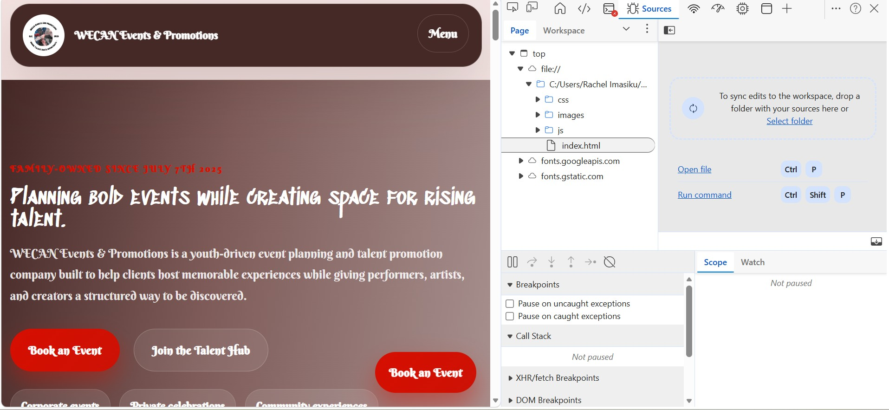
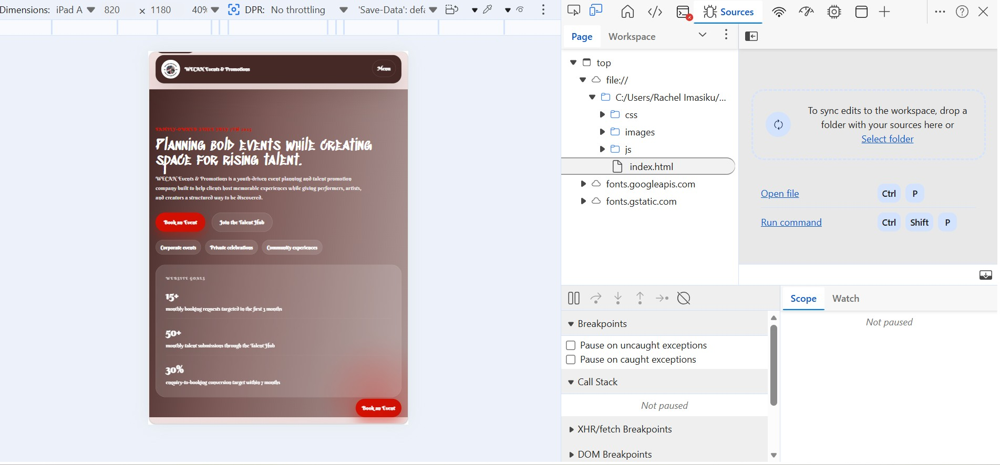
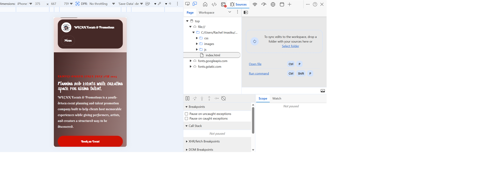
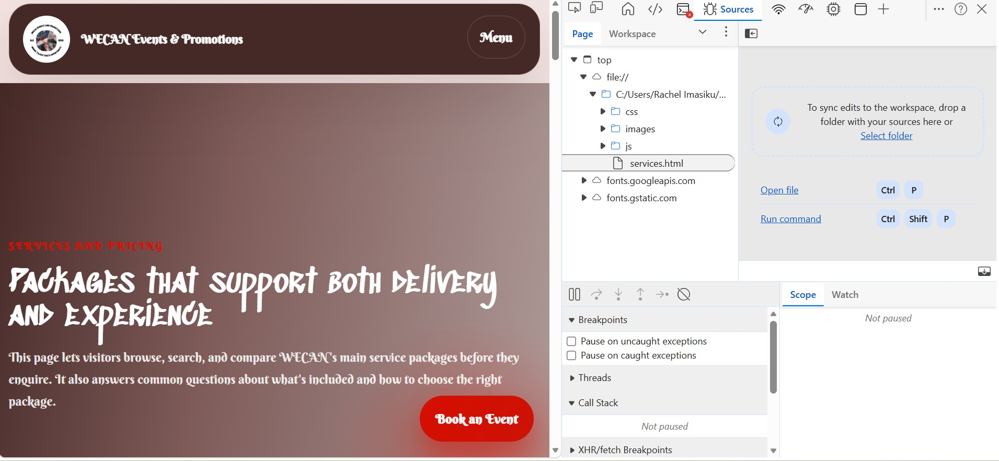
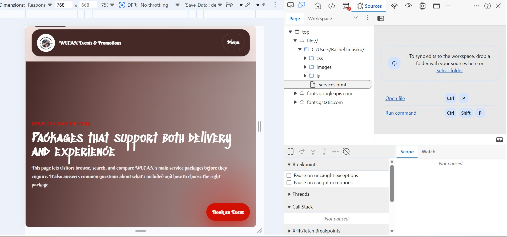
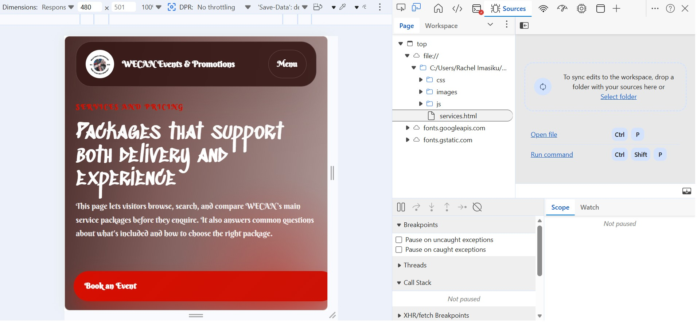
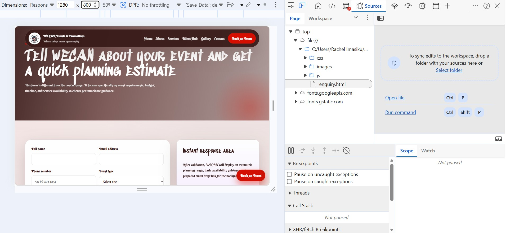
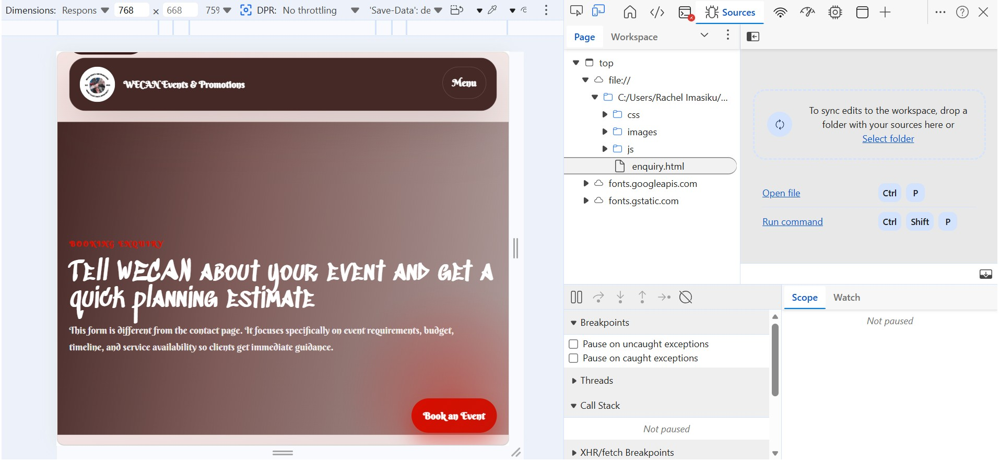
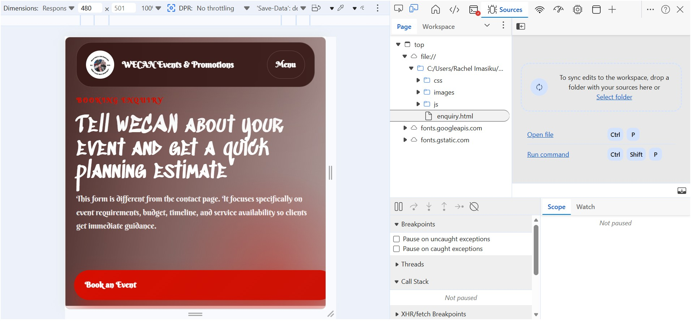

## WECAN Events & Promotions Website

### Student Information
- Module: WEB DEVELOPMENT (INTRODUCTION) - WEDE5020
- POE: website build for WECAN Events & Promotions (Pty) Ltd
- Student name: Reatile Warona Letsie Gabonewe
- Student number: ST10540396
- Group: 04

### Project Overview
This website was designed for WECAN Events & Promotions, a family-owned event planning and talent promotion company founded on 7th July 2025. The site presents the organisation professionally, gives clients a structured way to request event services, and gives emerging creatives a dedicated Talent Hub submission flow.

### Website Goals and Objectives
- Establish a professional digital presence beyond social media and word-of-mouth marketing.
- Allow clients to request event planning services directly through the website.
- Create a Talent Hub where young creatives can submit profiles and be discovered.
- Showcase WECAN's portfolio of event moments to build trust and attract new clients.

### Design System - Handcrafted Warm Aesthetic

#### Color Palette
The website uses a bold, warm, handcrafted color system:

- **Deep Red** `#D60E00` - Primary brand color representing passion and energy
- **Crimson Red** `#CC1205` - Accent color for highlights and CTAs
- **Dark Chocolate** `#361917` - Primary dark color for sophistication
- **Warm Brown** `#582F2C` - Secondary dark color for depth
- **Medium Brown** `#6B4A47` - Supporting brown for layering
- **Pure White** `#FFFFFF` - Clean contrast
- **Soft Cream** `#FAF5F4` - Warm background color
- **Light Blush** `#EDDFDE` - Soft accent background

#### Typography
- **Headings**: Sedgwick Ave Display - A handwritten display font that adds personality and creative flair
- **Body Text**: Berkshire Swash - A flowing script font that brings warmth and approachability

#### Design Philosophy
The design balances three key characteristics:
1. **Bold**: Deep red brand colors that command attention
2. **Warm**: Earthy brown tones and cream backgrounds create invitation
3. **Handcrafted**: Display fonts give a personal, creative touch

### Key Features and Functionality
- Multi-page HTML website with shared navigation and footer.
- Homepage with hero section, company overview, KPIs, services preview, and FAQ accordion.
- About page with organisation story, mission, vision, target audience, values, and team structure.
- Services page with package details, pricing tiers, search functionality, and filter buttons.
- Talent Hub page with validated creative profile submission form.
- Gallery page with filterable portfolio items and a lightbox image viewer.
- Enquiry page with validated booking form, budget estimate logic, and availability feedback.
- Contact page with multiple map locations, WhatsApp link, and a general email-ready contact form.
- Shared JavaScript for navigation, animation, accordions, counters, filtering, and form handling.
- Basic SEO support through per-page metadata, `robots.txt`, and `sitemap.xml`.
- Improved spacing and proportions for better visual hierarchy and readability.

### Timeline and Milestones
- Week 1: Research and proposal writing
- Week 2: Wireframes and planning
- Week 3: HTML development
- Week 4: CSS styling and layout
- Week 5: Testing and debugging

### Part Details
- Part 1 focus: semantic HTML structure, project organisation, sitemap-aligned pages, and content integration.
- Part 2 focus: external stylesheet, responsive layout, typography, and visual hierarchy.
- Part 3 focus: JavaScript interactions, forms, search/filtering, SEO support, and deploy-ready static files.

### Sitemap
- `index.html` - Homepage
- `about.html` - About the organisation
- `services.html` - Service packages and pricing
- `talent.html` - Talent Hub submission page
- `gallery.html` - Event gallery and portfolio
- `enquiry.html` - Booking enquiry form
- `contact.html` - General contact page and maps

### File Structure
```
wecan-website/
├── index.html
├── about.html
├── services.html
├── talent.html
├── gallery.html
├── enquiry.html
├── contact.html
├── css/
│   └── style.css
├── js/
│   └── main.js
├── images/
│   └── (event photos and logo)
├── robots.txt
├── sitemap.xml
└── README.md
```

### Changelog
- Rebuilt the original placeholder pages into a complete multi-page WECAN website aligned to the approved proposal.
- Added a new `gallery.html` page to match the proposal's portfolio/gallery requirement.
- Updated design system with handcrafted warm aesthetic (deep red, chocolate browns, soft cream) and creative typography (Sedgwick Ave Display, Berkshire Swash).
- Improved spacing, padding, and proportions throughout for better visual hierarchy and readability.
- Enhanced footer spacing to prevent text cramping.
- Increased card padding and grid gaps for better breathing room.
- Added JavaScript functionality for mobile navigation, scroll reveals, KPI counters, accordions, service filtering, gallery lightbox, and form responses.
- Created separate enquiry and contact form experiences so each page serves a distinct purpose in line with the POE guide.
- Added `robots.txt` and `sitemap.xml` for SEO-related Part 3 requirements.

### References
- CIPC. (2024). Companies and Intellectual Property Commission: Register your business.
- Google Developers. (2024). Google Maps Embed documentation.
- Google Fonts. (2024). Sedgwick Ave Display and Berkshire Swash font families.
- Mozilla Developer Network. (2024). HTML, CSS and JavaScript web documentation.
- Netlify. (2024). Netlify deployment platform.
- W3C. (2023). Web Content Accessibility Guidelines (WCAG) 2.1.
- WhatsApp Business. (2024). WhatsApp Business for small and medium organisations.

### Notes
- The proposal listed the domain with underscores. Real domain names cannot use underscores, so a deploy-friendly version such as `wecan-events-and-promotions.co.za` will be instead used.
- If any images in the `images` folder were sourced externally, add the exact source URLs and access dates before final submission so the references section stays accurate.
- Design system updated to reflect handcrafted warm aesthetic with bold red brand colors, earthy browns, and creative display typography.
- Spacing and proportions improved throughout for better visual balance and professional presentation.


---

## Part 2: CSS Styling & Responsive Design

### Responsive Breakpoints

| Breakpoint | Width | Changes Applied |
|-----------|-------|----------------|
| Desktop | 1280px+ | Full layout, 3-column grids, horizontal nav |
| Tablet | max-width: 768px | 2-column grid, stacked footer, adjusted fonts |
| Mobile | max-width: 480px | Single column, full-width forms, compact nav |

### Layout Techniques Used
- Flexbox: navigation, hero section, footer, portfolio container
- CSS Grid: services cards, gallery grid
- Relative units: rem, em, % used throughout
- Pseudo-classes: :hover, :focus, :active on all interactive elements

### Screenshot Evidence
Testing done using Chrome DevTools Toggle Device Toolbar.

**index.html**
| Device | Screenshot |
|--------|-----------|
| Desktop |  |
| Tablet |  |
| Mobile |  |

**services.html**
| Device | Screenshot |
|--------|-----------|
| Desktop |  |
| Tablet |  |
| Mobile |  |

**enquiry.html**
| Device | Screenshot |
|--------|-----------|
| Desktop |  |
| Tablet |  |
| Mobile |  |

---

## Part 2 Changelog - 2026-05-29

- Added responsive breakpoints for tablet (768px) and mobile (480px)
- Applied Flexbox to navigation, hero, footer and portfolio sections
- Applied CSS Grid to services cards and gallery
- Added pseudo-classes: :hover, :focus, :active throughout
- Fixed footer email overlap using word-wrap
- Added portfolio carousel with CSS transitions
- Collected screenshot evidence across desktop, tablet and mobile
- Added screenshots/ folder with responsive testing evidence

---

## Updated References

- Mozilla Developer Network. (2026). *CSS Flexbox Layout.* [Online]. Available at: https://developer.mozilla.org/en-US/docs/Web/CSS/CSS_flexible_box_layout [Accessed: 29 May 2026].
- Mozilla Developer Network. (2026). *Using media queries.* [Online]. Available at: https://developer.mozilla.org/en-US/docs/Web/CSS/CSS_media_queries [Accessed: 29 May 2026].
- W3Schools. (2026). *CSS Responsive Web Design.* [Online]. Available at: https://www.w3schools.com/css/css_rwd_intro.asp [Accessed: 29 May 2026].